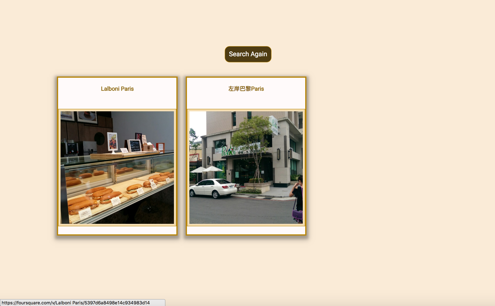

# Taiwan_Restaurant_App

## URL

https://annech787.github.io/Taiwan_Restaurant_App/

## Screenshots

### Landing Page

### Result Page

## Summary

The Taiwan_ Restaurant_App allows users to search for restaurants in Taiwan.  
Users can input the restaurant by name or preference on the type of restaurant that they want  
in the search box.  Once the users click the search button, the landing page disappears and the 
results of the search appear.  Users can click on restaurant name and photo to go to the Foursquare
website that contains information about that particular restaurant.  

## Technology Used

HTML/CSS/Javascript/jQuery
